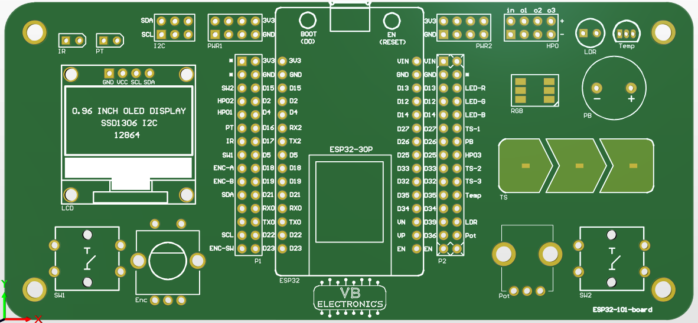

# About

Redsting is a ble RC car. Esp32 on board controlled by PS3 controller

## Basic functions

`X` - 	Forward		 

`/\` -  Backward

`[]` - Not in use

`()` - Not in use

`R1` - Forward

`R2` - Backward

`LeftAnalog` - Turn Left/Right

`Start` - disconnect from Esp32 and send deepsleep command

etc.

## sample picture

img src="img/ESP32-VROOM-32D-PINOUT.png" alt="Screenshot" style="zoom:33%;" />
*Above: Cupcake indexer in progress*
